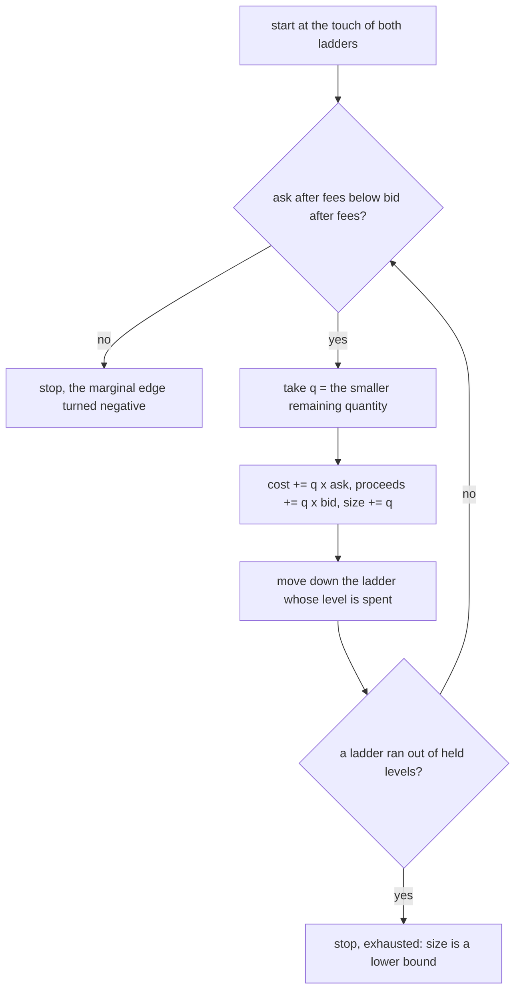

# Edge at the touch

The reading that treats the best level of each book as if it were infinitely deep.

`netPpm` is the fee adjusted best bid on one venue over the fee adjusted best ask on another.
It is the right trigger, because if the best levels do not cross after fees then no deeper level does either.
It is the wrong measure of an opportunity, because it says nothing about how much of the cross the books would actually pay for.
A cross of 5,000 ppm on a level that holds eleven dollars and a cross of 5,000 ppm on a level that holds two hundred thousand dollars read as the same number.

## The row that produced it

The clearest case is in [`thin-book.md`](./thin-book.md): a best price that was real, held eleven dollars, and moved 7 percent when its one maker cancelled.
The third run audit in [`../research/2026-09-06-third-run-data-audit.md`](../research/2026-09-06-third-run-data-audit.md) found that no row of the 745 could prove a capturable spread, because every row carried a price and not a quantity.

## The books behind it

Two constructed ladders, fees left out so the arithmetic can be followed by hand.
We buy on venue A and sell on venue B.
Both are shown from the touch down, so the asks rise and the bids fall.

```
venue A, asks we buy            venue B, bids we sell into
price     size                  price     size
100.05    2      <- touch       100.60    1      <- touch
100.10    4                     100.55    3
100.20    5                     100.30    6
100.35    3                     100.10    2
```

The edge at the touch is 100.60 over 100.05, about 5,500 ppm.
The touch holds one coin on the sell side.
Whether the opportunity is one coin or ten is a question the touch cannot answer, and the ladders can.

## How to detect it: the ladder walk

The walk consumes both ladders from the top down and stops where the next pair of levels no longer crosses.
Everything it consumed is the region both books were paying for.

Two facts make it a single pass.
Asks are ascending and bids are descending, so each step's edge is at most the previous step's edge.
The profitable levels are therefore a prefix of the walk, and the first pair that does not cross ends it.
No size has to be guessed and no size has to be searched.



In words:

1. Point at level zero of the buy venue's asks and level zero of the sell venue's bids.
2. If the ask after fees is at or above the bid after fees, stop, the region has ended on price.
3. Take the smaller of the two remaining quantities, add it to the size, add quantity times ask to the cost and quantity times bid to the proceeds.
4. Move down whichever ladder just ran dry, both if they held the same quantity.
5. If a ladder has no held level left, stop, and mark the region exhausted.
6. Otherwise go back to step 2.

The average edge over the region is proceeds over cost minus one, in ppm.
The size is the coins the region holds.
The notional is the cost, which is what buying the region would have taken.

### Worked example, the ladders above

| step | ask level | bid level | quantity taken | cost so far | proceeds so far | size so far | marginal ppm |
|---:|---|---|---:|---:|---:|---:|---:|
| 1 | 100.05 x 2 | 100.60 x 1 | 1 | 100.05 | 100.60 | 1 | 5,497 |
| 2 | 100.05 x 1 left | 100.55 x 3 | 1 | 200.10 | 201.15 | 2 | 4,998 |
| 3 | 100.10 x 4 | 100.55 x 2 left | 2 | 400.30 | 402.25 | 4 | 4,496 |
| 4 | 100.10 x 2 left | 100.30 x 6 | 2 | 600.50 | 602.85 | 6 | 1,998 |
| 5 | 100.20 x 5 | 100.30 x 4 left | 4 | 1,001.30 | 1,004.05 | 10 | 998 |
| 6 | 100.20 x 1 left | 100.10 x 2 | stop | | | | negative |

The region is ten coins.
The cost is 1,001.30, the proceeds are 1,004.05, and the average edge is 2,746 ppm.
The edge at the touch was 5,497 ppm, held by one coin.
Both numbers are true, and only the second one says what the two books were worth together.

### Worked example, the thin book

```
venue A, asks we buy            venue B, bids we sell into
100.00    50                    100.55    0.11   <- eleven dollars
                                 99.90    40
```

The touch reads 5,500 ppm.
The walk takes 0.11 coins at 100.00 against 100.55, then meets 99.90 against 100.00 and stops.
The region is 0.11 coins, eleven dollars, at 5,500 ppm.
The row would carry the same ppm as before and a notional of eleven, and the ranking can throw it away.

### Worked example, an exhausted book

```
venue A, asks we buy            venue B, bids we sell into
100.00    1                     102.00    5
                                101.90    5
```

The walk takes one coin and the ask ladder has no level left.
The marginal edge was still about 20,000 ppm when it stopped, so the true region is larger than one coin and the walk cannot say by how much.
The sample is marked exhausted, and its size and notional are lower bounds.
This is what the twenty held levels cost on a very thin buy side, and it is rare on liquid books.

### Worked example, fees

Fees enter as multipliers on price, not as a deduction afterwards.
The buy venue's asks are multiplied by one plus its taker fee, the sell venue's bids by one minus its taker fee.
With 55 basis points each side:

```
raw                       after fees
ask 100.00  bid 102.00    100.55  vs  101.44   crosses
ask 100.50  bid 101.50    101.05  vs  100.94   does not
```

Without fees both pairs cross and the region is two coins.
With fees the region is one coin.
The walk applies the multipliers at each step, so a pair that crosses raw and fails after fees ends the region where it should.

### Worked example, contract units

Sizes arrive as the venue counts them, and okx counts contracts of a hundredth of a coin.
The cluster's `sizeMul` brings every size to coins before quantities are matched, so 300 okx contracts against 5 bybit coins is a region of 3 coins and not of 5.
Without that step the walk would match 300 against 5 and report a region sixty times too large.

## What the engine records

The walk runs on every sample of an open route and at the tick that opens it, in [`../../server/src/engine/ladderWalk.ts`](../../server/src/engine/ladderWalk.ts), called from `OpportunityManager`.
It reads the two legs' slots of the depth block, which the book feeds keep at most 100 ms old.
Each result is an `EdgeSample`: average ppm, size in coins, notional in the quote asset, an exhausted flag, and how many levels each side reached into.

An opportunity carries the sample at its open, the sample with the best average ppm and when it happened, the last sample, the largest notional any sample reached, and how many samples had depth on both legs.
When a leg holds no depth the sample is null and the count does not move, so a row can say how much of the episode the walk covered.

The walk is a measurement and not a gate.
Nothing opens or closes because of it yet.
The legitimacy ruleset decides in SQL which of these numbers becomes a filter, and only after a run has been re-audited against them.

## What it costs

At most one step per held level on either side, so at most forty steps with twenty levels a slot.
A few microseconds per sample.
The engine runs discovery about 850 times a second across the whole universe, so the walk adds about a tenth of a millisecond of work per second.

## What it cannot see

- A standing basis.
  Two deep books that never converge produce a large region with a steady edge, and the walk reports it faithfully.
  Only the legs' index, mark and funding tell that spread from an arbitrage, which is why those pairs are denied by hand until that check exists.
- Time.
  The two books come from two sockets and may be up to 100 ms apart, and the walk has no opinion about how long the region lived.
  Duration and the minimum episode age are separate columns.
- Hidden liquidity.
  Icebergs and orders that arrive between the read and a fill are not in any book.
  The region is what was resting, no more.
